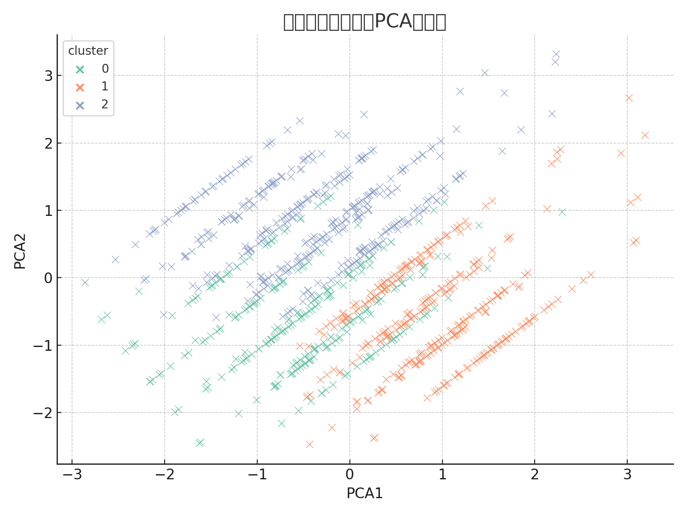

# 🚗 交通速度聚类分析项目（KMeans + 异常检测）

本项目基于交通速度数据，结合车型与时间段信息，使用 **KMeans 聚类算法** 和 **IQR 异常检测**方法，识别不同类型的交通行为模式，并进行可视化与解释分析。

## 📂 项目结构

```
traffic-speed-clustering/
├── data/
│   └── traffic_speed_data.csv
├── report/
│   └── cluster_report.md
├── notebooks/
│   └── analysis.ipynb
├── README.md
```

## 🧰 技术栈与方法
- Python + Pandas + Scikit-learn
- KMeans 聚类分析
- IQR 异常值检测
- PCA 降维 + 可视化

## 📈 聚类分析可视化图示

### 🌀 聚类结果可视化（PCA 降维）


### 📦 各聚类的速度分布（箱型图）


## 📎 报告详情
请查看：`report/cluster_report.md`
